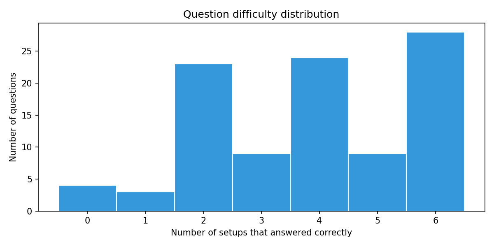
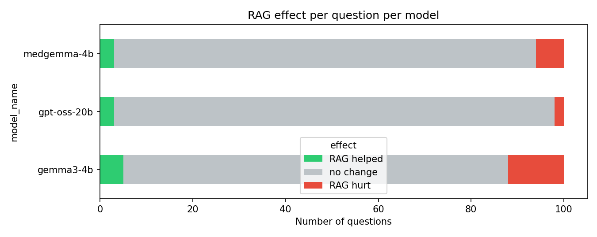
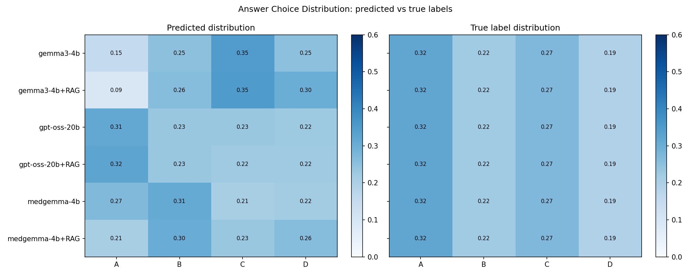

# Error Analysis Report

**Experiment**: `medical_mcq_comparison_3_100`  
**Questions**: 100  
**Setups**: 6

---

## Question Difficulty Distribution

How many setups answered each question correctly.

|   setups_correct |   n_questions |   pct |
|-----------------:|--------------:|------:|
|                0 |             4 |     4 |
|                1 |             3 |     3 |
|                2 |            23 |    23 |
|                3 |             9 |     9 |
|                4 |            24 |    24 |
|                5 |             9 |     9 |
|                6 |            28 |    28 |

- **All wrong** (0/6): 4 questions
- **All correct** (6/6): 28 questions

---

## Hardest Questions (fewest setups correct)

| question_id     | correct_answer   |   models_correct | gemma3-4b   | gemma3-4b+RAG   | gpt-oss-20b   | gpt-oss-20b+RAG   | medgemma-4b   | medgemma-4b+RAG   |
|:----------------|:-----------------|-----------------:|:------------|:----------------|:--------------|:------------------|:--------------|:------------------|
| medqa_test_928  | B                |                0 | ✗           | ✗               | ✗             | ✗                 | ✗             | ✗                 |
| medqa_test_88   | C                |                0 | ✗           | ✗               | ✗             | ✗                 | ✗             | ✗                 |
| medqa_test_778  | C                |                0 | ✗           | ✗               | ✗             | ✗                 | ✗             | ✗                 |
| medqa_test_285  | C                |                0 | ✗           | ✗               | ✗             | ✗                 | ✗             | ✗                 |
| medqa_test_1266 | C                |                1 | ✗           | ✗               | ✗             | ✓                 | ✗             | ✗                 |
| medqa_test_114  | C                |                1 | ✗           | ✗               | ✓             | ✗                 | ✗             | ✗                 |
| medqa_test_198  | D                |                1 | ✗           | ✗               | ✗             | ✓                 | ✗             | ✗                 |
| medqa_test_228  | A                |                2 | ✗           | ✗               | ✓             | ✓                 | ✗             | ✗                 |
| medqa_test_469  | A                |                2 | ✗           | ✗               | ✓             | ✓                 | ✗             | ✗                 |
| medqa_test_940  | A                |                2 | ✗           | ✗               | ✓             | ✓                 | ✗             | ✗                 |

---

## RAG Effect Per Question

For each model: how many questions did RAG help, hurt, or leave unchanged?

| model_name   |   RAG helped |   RAG hurt |   no change |
|:-------------|-------------:|-----------:|------------:|
| gemma3-4b    |            5 |         12 |          83 |
| gpt-oss-20b  |            3 |          2 |          95 |
| medgemma-4b  |            3 |          6 |          91 |

### gemma3-4b
- RAG helped on: ['medqa_test_1103', 'medqa_test_1232', 'medqa_test_146', 'medqa_test_318', 'medqa_test_864']
- RAG hurt on:   ['medqa_test_189', 'medqa_test_206', 'medqa_test_209', 'medqa_test_283', 'medqa_test_326', 'medqa_test_505', 'medqa_test_542', 'medqa_test_65', 'medqa_test_689', 'medqa_test_775', 'medqa_test_810', 'medqa_test_919']

### gpt-oss-20b
- RAG helped on: ['medqa_test_1161', 'medqa_test_1266', 'medqa_test_198']
- RAG hurt on:   ['medqa_test_114', 'medqa_test_689']

### medgemma-4b
- RAG helped on: ['medqa_test_189', 'medqa_test_548', 'medqa_test_821']
- RAG hurt on:   ['medqa_test_209', 'medqa_test_51', 'medqa_test_542', 'medqa_test_563', 'medqa_test_740', 'medqa_test_919']

---

## Answer Choice Bias

Predicted vs true answer-choice frequencies. Uniform = 0.25 per choice.

| setup_name      |   pred_A |   pred_B |   pred_C |   pred_D |   pred_null |
|:----------------|---------:|---------:|---------:|---------:|------------:|
| gemma3-4b       |    0.153 |    0.250 |    0.347 |    0.250 |       0.000 |
| gemma3-4b+RAG   |    0.090 |    0.260 |    0.350 |    0.300 |       0.000 |
| gpt-oss-20b     |    0.314 |    0.231 |    0.231 |    0.224 |       0.003 |
| gpt-oss-20b+RAG |    0.324 |    0.234 |    0.221 |    0.221 |       0.003 |
| medgemma-4b     |    0.269 |    0.310 |    0.205 |    0.215 |       0.010 |
| medgemma-4b+RAG |    0.206 |    0.304 |    0.230 |    0.260 |       0.013 |
