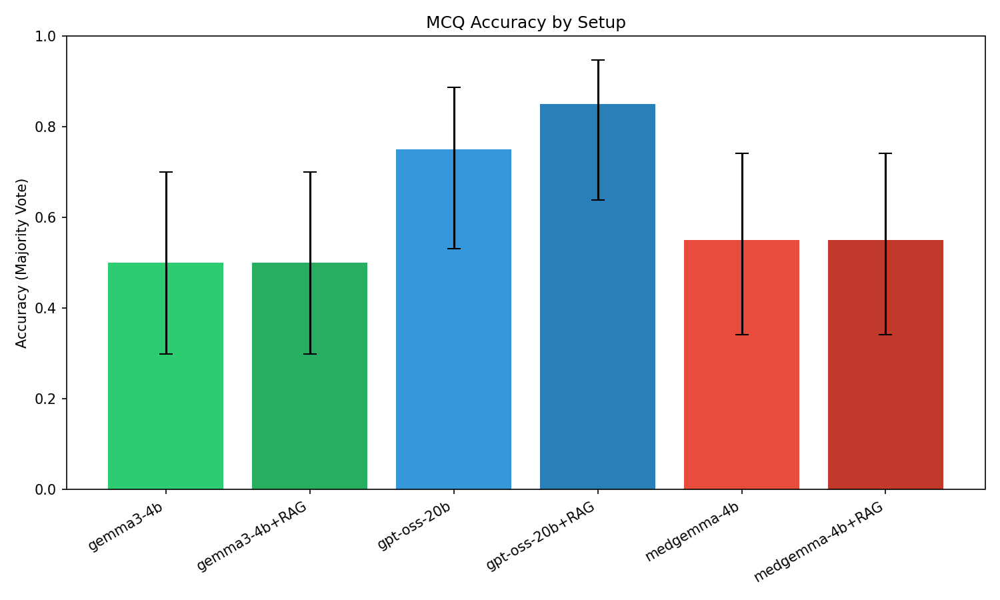
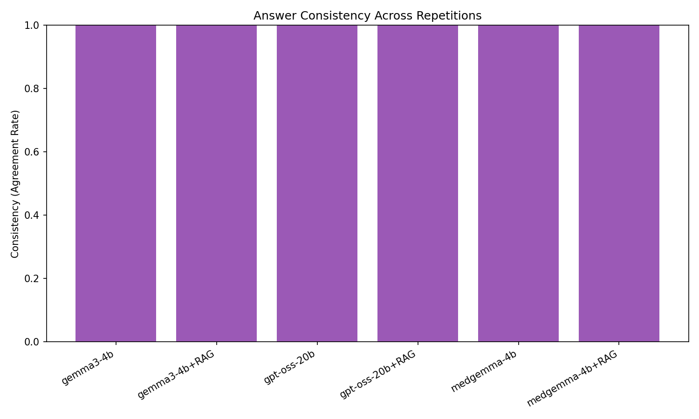
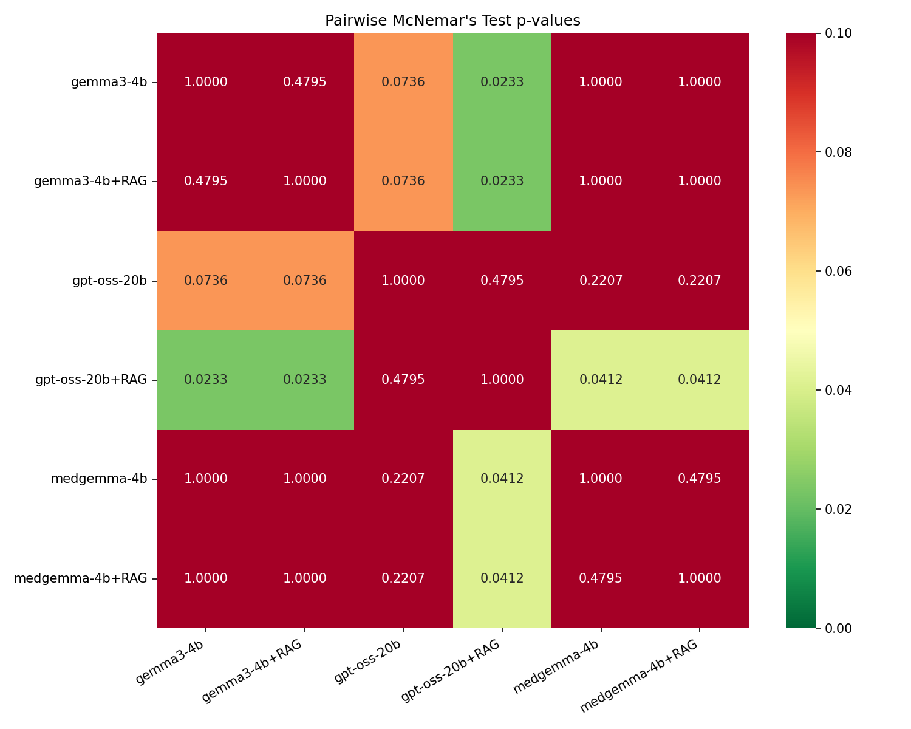

# Experiment Report: What Makes It Right?

## Research Question
What is more crucial for medical multiple-choice QA accuracy: model size, domain expertise, or retrieved knowledge?

## Setup Summary
- **Domain (inferred)**: medical
- **Questions**: 20
- **Repetitions per question**: 1
- **Total LLM calls**: 120

## Accuracy Results (Majority Vote)

| setup_name      |   accuracy |   ci_lower |   ci_upper |   correct |   total |
|:----------------|-----------:|-----------:|-----------:|----------:|--------:|
| gemma3-4b       |     0.5000 |     0.2993 |     0.7007 |        10 |      20 |
| gemma3-4b+RAG   |     0.5000 |     0.2993 |     0.7007 |        10 |      20 |
| gpt-oss-20b     |     0.7500 |     0.5313 |     0.8881 |        15 |      20 |
| gpt-oss-20b+RAG |     0.8500 |     0.6396 |     0.9476 |        17 |      20 |
| medgemma-4b     |     0.5500 |     0.3421 |     0.7418 |        11 |      20 |
| medgemma-4b+RAG |     0.5500 |     0.3421 |     0.7418 |        11 |      20 |

## Mean Per-Question Accuracy

| setup_name      |   mean_accuracy |
|:----------------|----------------:|
| gemma3-4b       |          0.5000 |
| gemma3-4b+RAG   |          0.5000 |
| gpt-oss-20b     |          0.7500 |
| gpt-oss-20b+RAG |          0.8500 |
| medgemma-4b     |          0.5500 |
| medgemma-4b+RAG |          0.5500 |

## Consistency (Agreement Across Repetitions)

| setup_name      |   consistency |
|:----------------|--------------:|
| gemma3-4b       |        1.0000 |
| gemma3-4b+RAG   |        1.0000 |
| gpt-oss-20b     |        1.0000 |
| gpt-oss-20b+RAG |        1.0000 |
| medgemma-4b     |        1.0000 |
| medgemma-4b+RAG |        1.0000 |

## Parse Failure Rate

| setup_name      |   parse_failure_rate |
|:----------------|---------------------:|
| gemma3-4b       |               0.0000 |
| gemma3-4b+RAG   |               0.0000 |
| gpt-oss-20b     |               0.2000 |
| gpt-oss-20b+RAG |               0.1000 |
| medgemma-4b     |               0.0000 |
| medgemma-4b+RAG |               0.0000 |

## Pairwise Statistical Tests (McNemar's)

| setup_a         | setup_b         |   a_only_correct |   b_only_correct |   statistic |   p_value | significant   |
|:----------------|:----------------|-----------------:|-----------------:|------------:|----------:|:--------------|
| gemma3-4b       | gemma3-4b+RAG   |                1 |                1 |      0.5000 |    0.4795 | False         |
| gemma3-4b       | gpt-oss-20b     |                0 |                5 |      3.2000 |    0.0736 | False         |
| gemma3-4b       | gpt-oss-20b+RAG |                0 |                7 |      5.1429 |    0.0233 | True          |
| gemma3-4b       | medgemma-4b     |                2 |                3 |      0.0000 |    1.0000 | False         |
| gemma3-4b       | medgemma-4b+RAG |                2 |                3 |      0.0000 |    1.0000 | False         |
| gemma3-4b+RAG   | gpt-oss-20b     |                0 |                5 |      3.2000 |    0.0736 | False         |
| gemma3-4b+RAG   | gpt-oss-20b+RAG |                0 |                7 |      5.1429 |    0.0233 | True          |
| gemma3-4b+RAG   | medgemma-4b     |                2 |                3 |      0.0000 |    1.0000 | False         |
| gemma3-4b+RAG   | medgemma-4b+RAG |                1 |                2 |      0.0000 |    1.0000 | False         |
| gpt-oss-20b     | gpt-oss-20b+RAG |                0 |                2 |      0.5000 |    0.4795 | False         |
| gpt-oss-20b     | medgemma-4b     |                5 |                1 |      1.5000 |    0.2207 | False         |
| gpt-oss-20b     | medgemma-4b+RAG |                5 |                1 |      1.5000 |    0.2207 | False         |
| gpt-oss-20b+RAG | medgemma-4b     |                6 |                0 |      4.1667 |    0.0412 | True          |
| gpt-oss-20b+RAG | medgemma-4b+RAG |                6 |                0 |      4.1667 |    0.0412 | True          |
| medgemma-4b     | medgemma-4b+RAG |                1 |                1 |      0.5000 |    0.4795 | False         |

## RAG Effect Tests

| setup_a     | setup_b         |   a_only_correct |   b_only_correct |   statistic |   p_value | significant   |
|:------------|:----------------|-----------------:|-----------------:|------------:|----------:|:--------------|
| gemma3-4b   | gemma3-4b+RAG   |                1 |                1 |      0.5000 |    0.4795 | False         |
| gpt-oss-20b | gpt-oss-20b+RAG |                0 |                2 |      0.5000 |    0.4795 | False         |
| medgemma-4b | medgemma-4b+RAG |                1 |                1 |      0.5000 |    0.4795 | False         |